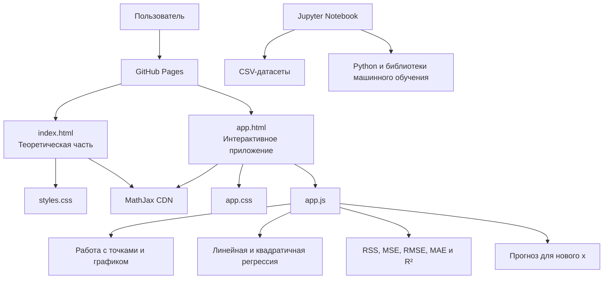

# Linear Regression Lab

Учебный статический проект для курсовой работы по теме **“Визуализация алгоритмов машинного обучения”**.

Алгоритм: **линейная регрессия** и её расширение до **квадратичной регрессии степени 2**.

Проект сделан на чистом HTML/CSS/JS. Backend, npm, React, TypeScript и сборщики не используются.

**Рабочая версия приложения:** [открыть Linear Regression Lab](https://ufpngh.github.io/linear_regression_coursework/)

## Что входит в проект

- `index.html` — обучающая статья для новичка.
- `app.html` — мобильное web-приложение для практики.
- `app.js` — логика графика, точек, регрессии, residuals и метрик.
- `styles.css` — стили теоретической статьи.
- `app.css` — стили приложения.
- MathJax через CDN — рендер LaTeX-формул в статье и приложении.
- `datasets/` — CSV-датасеты для демонстраций.
- `notebooks/linear_regression_demo.ipynb` — учебная Jupyter-тетрадка.
- `docs/TECHNICAL_SPEC_FOR_CODEX.md` — техническое задание.
- `docs/CODE_WALKTHROUGH.md` — объяснение кода для подготовки к защите.
- `requirements.txt` — зависимости для notebook.

## Что реализовано

- понятная статья о линейной регрессии;
- объяснение `x`, `y`, `ŷ`, residuals и RSS;
- объяснение, почему ошибки возводятся в квадрат;
- вывод смысла формул `a = Sxy / Sxx` и `b = ȳ - a·x̄`;
- объяснение R² через baseline-модель “всегда среднее y”;
- интерактивное добавление точек кликом или тапом;
- выбор точки на графике;
- перетаскивание точек мышью и пальцем через pointer events;
- ручное редактирование координат выбранной точки;
- удаление выбранной точки кнопкой или клавишей Delete/Backspace;
- переключение модели: линия или парабола;
- выбор учебных наборов в приложении: простой, шумный, с выбросом, нелинейный;
- линейная регрессия через ручные формулы `Sxx` и `Sxy`;
- квадратичная регрессия через normal equation и solver 3x3 без библиотек;
- residuals как вертикальные линии от точки до модели;
- метрики RSS, MSE, RMSE, MAE, R²;
- сравнение линейной модели и параболы;
- поле прогноза: ввод `x` и получение `ŷ`;
- нормальные LaTeX-формулы через MathJax, без React/npm/backend;
- Jupyter Notebook с ручным расчётом, проверкой через sklearn и реалистичным учебным датасетом.

## Как запустить notebook

Установить зависимости:

```bash
pip install -r requirements.txt
```

Запустить Jupyter:

```bash
jupyter notebook notebooks/linear_regression_demo.ipynb
```

В notebook показано:

- игрушечные линейные данные;
- ручной расчёт `x_mean`, `y_mean`, `Sxx`, `Sxy`, `a`, `b`;
- residuals, RSS, MSE, RMSE, MAE, R²;
- проверка через `sklearn`;
- сравнение прямой и параболы;
- влияние выброса;
- реалистичный учебный CSV `datasets/real_estate_realistic.csv`;
- сравнение модели по одному признаку и по нескольким признакам.

## Датасеты

В папке `datasets/` находятся:

- `apartments_simple.csv` — простой линейный пример;
- `noisy_data.csv` — данные с шумом;
- `outlier_data.csv` — данные с выбросом;
- `nonlinear_data.csv` — нелинейный пример;
- `real_estate_realistic.csv` — реалистичный учебный набор данных о квартирах.

Важно: `real_estate_realistic.csv` является учебным сгенерированным датасетом, похожим на данные о недвижимости. Его не нужно выдавать за реальные сделки.

## Структура проекта

```text
linear_regression_coursework/
├── index.html
├── app.html
├── styles.css
├── app.css
├── app.js
├── datasets/
│   ├── apartments_simple.csv
│   ├── noisy_data.csv
│   ├── outlier_data.csv
│   ├── nonlinear_data.csv
│   └── real_estate_realistic.csv
├── notebooks/
│   └── linear_regression_demo.ipynb
├── docs/
│   ├── TECHNICAL_SPEC_FOR_CODEX.md
│   └── CODE_WALKTHROUGH.md
├── requirements.txt
└── README.md
```
## Архитектура проекта

Проект представляет собой статическое клиентское web-приложение. Все вычисления выполняются непосредственно в браузере пользователя. Серверная часть и база данных отсутствуют.



### Основные компоненты

- `index.html` отвечает за теоретическую часть и переход к практике
- `app.html` содержит интерфейс интерактивного приложения
- `app.js` обрабатывает действия пользователя, вычисляет параметры моделей, прогнозы и метрики
- `styles.css` и `app.css` отвечают за оформление теоретической и практической частей
- MathJax подключается через CDN и используется для отображения математических формул
- Jupyter Notebook независимо демонстрирует обучение моделей на подготовленных CSV-датасетах
- GitHub Pages публикует статические файлы проекта в интернете

Данные, добавленные пользователем в приложении, существуют только в памяти текущей страницы и не отправляются на внешний сервер.

## Авторы

- Парпиев Озодбек Зафарович
- Мирзаев Махмадмурод Машхурович
